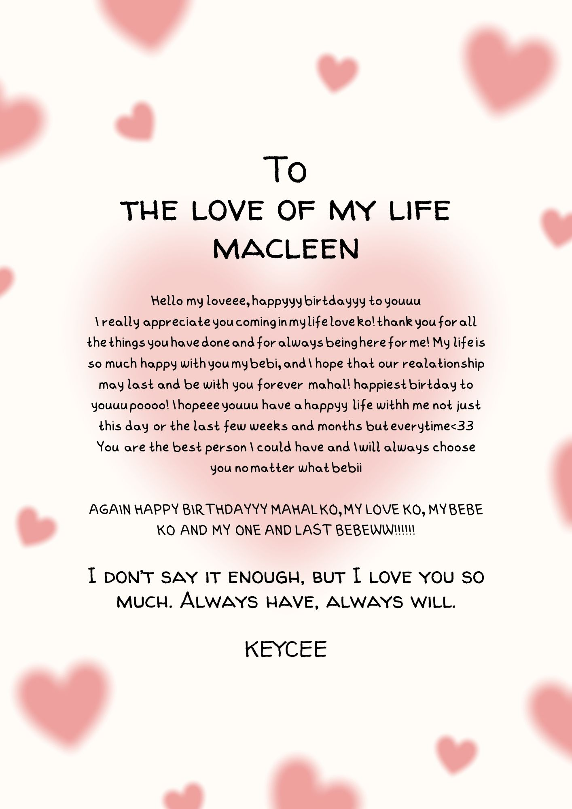

<html>
<head>
<title>ehekk</title>

</head>
<body>
<h1> Heyy baby!</h1>

<h1 style="#">Do you have any idea what is on the menu?</h1>

<input type="button" value=" YES " onClick="f1()" />

<input type="button" value=" NO " onMouseOver="f()" />

</body>
</html>
 
 
 

<!DOCTYPE html>
<html>
<head> </head>
<body>

<title></title>
</head>

<body bgcolor="purple">

<h1>
<b>
HI MACLEEN
<!DOCTYPE html>
<html>
<head>
<title>Happy Birthday My Love</title>
</head>

<body bgcolor="purple">

<b>
<em>

H&nbsp;&nbsp;A&nbsp;&nbsp;P&nbsp;&nbsp;P&nbsp;&nbsp;Y&nbsp;&nbsp;&nbsp;&nbsp;B&nbsp;&nbsp;I&nbsp;&nbsp;R&nbsp;&nbsp;T&nbsp;&nbsp;H&nbsp;&nbsp;D&nbsp;&nbsp;A&nbsp;&nbsp;Y&nbsp;&nbsp;&nbsp;&nbsp;M&nbsp;&nbsp;Y&nbsp;&nbsp;&nbsp;&nbsp;L&nbsp;&nbsp;O&nbsp;&nbsp;V&nbsp;&nbsp;E&nbsp;&nbsp;&nbsp;&nbsp;K&nbsp;&nbsp;O
</marquee>

</em>
</
</em>

<marquee behavior="scroll" direction="right"D>
HAPPY BIRTHDAY MY LOVEE</text>
</marquee>
<marquee behavior="scroll" direction="right"D>
           
</marquee>
<marquee behavior="scroll" direction="left"D>
I LOVE YOU SO MUCH</text>
</marquee>
<marquee behavior="scroll" direction="left">
           
</marquee>
<marquee behavior="scroll" direction="right"D>
MWUAAHH MWUAAHH MWUAHHH</text>
</marquee>		
<marquee behavior="scroll" direction="right">
           
</marquee>

<marquee="center">
          
</marquee>
 	
<marquee="center">
  
</marquee>

</body>
</html>
